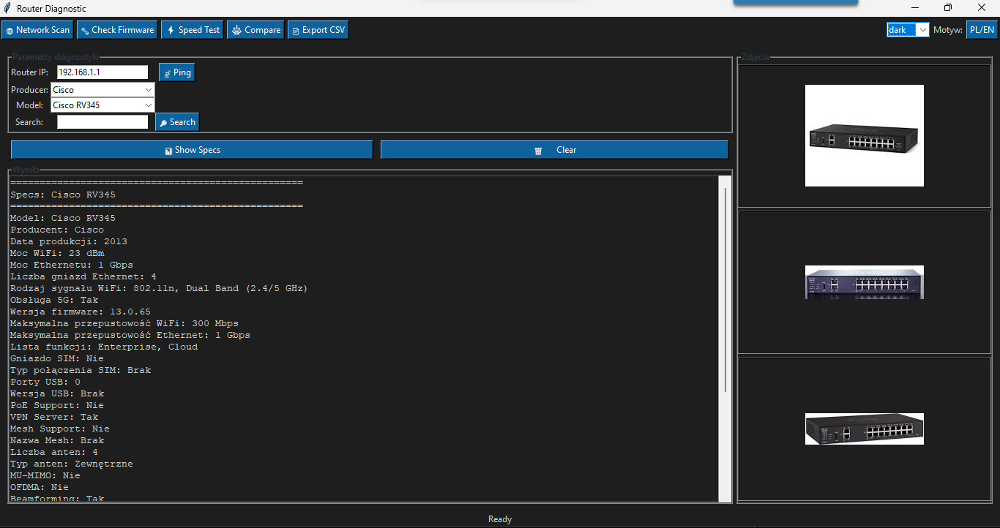

# 🔍 Router Diagnostic Tool


A comprehensive, multilingual (🇵🇱 Polish / 🇬🇧 English) router diagnostic application with an extended database of **829 router models** from 2005–2025, featuring **live Google Images preview** of router appearance.

---

## 📸 Screenshot



*(Add a screenshot of your application as `screenshot.png` in the repository root)*

---

## ✨ Features

### 🌐 Network Diagnostics
- **Ping Test** – Real-time connection testing to router
- **Network Analysis** – Advanced diagnostics with detailed output
- **Multi-router Support** – Test multiple devices

### 📊 Extensive Router Database
- **829 Router Models** – Complete database (2005–2025)
- **Live Image Preview** – Automatic Google Images search and display
- **30+ Specifications** per router:
  - WiFi standards (802.11g/n/ac/ax/be)
  - Ethernet speeds (100Mbps - 10Gbps)
  - Band support (Single/Dual/Tri/Quad-band)
  - Firmware versions
  - Ports, features, and more

### 🏢 Supported Manufacturers
- **Linksys** – 80+ models
- **ASUS** – 120+ models
- **Netgear** – 100+ models
- **TP-Link** – 100+ models
- **D-Link** – 50+ models
- **Apple** (AirPort series)
- **Google** (Nest Wifi)
- **Amazon** (eero series)
- **Xiaomi** (Mi Router series)
- **Ubiquiti** (UniFi, AmpliFi)
- And many more: Buffalo, MikroTik, Synology, Huawei, ZTE, Tenda, Cudy...

### 🖼️ Visual Features
- **Live Google Images** – Automatically fetches and displays router photos
- **Beautiful Placeholders** – Generated graphics when images unavailable
- **3 Images per Router** – Multiple views of each device
- **No Browser Required** – All image processing happens in-app

### 🔍 Smart Search
- **Autocomplete** – Intelligent model suggestions as you type
- **Producer Filter** – Browse by manufacturer
- **Keyword Search** – Find routers by name, model, or feature
- **Real-time Results** – Instant filtering

### 🌍 Multilingual Interface
- **Polish (Polski)** – Native Polish interface
- **English** – Full English translation
- **Easy Language Switch** – Toggle with one click (🇵🇱 PL / 🇬🇧 EN)

---

## 🚀 Installation

### Prerequisites

```bash
Python 3.8 or higher
```

### Required Libraries

```bash
pip install pillow requests beautifulsoup4
```

### Quick Start

```bash
# 1. Clone the repository
git clone https://github.com/yourusername/router-diagnostic-tool.git
cd router-diagnostic-tool

# 2. Install dependencies
pip install -r requirements.txt

# 3. Run the application
python router_diag_gui_multilang.py
```

---

## 📁 Project Structure

```
router-diagnostic-tool/
│
├── router_diag_gui_multilang.py   # Main GUI application
├── router_database.py              # Database library
├── router_database.csv             # Router specifications (829 models)
│
├── requirements.txt                # Python dependencies
├── README.md                       # This file
└── screenshot.png                  # Application screenshot (optional)
```

---

## 🎮 Usage Guide

### Basic Usage

1. **Launch Application**
   ```bash
   python router_diag_gui_multilang.py
   ```

2. **Network Testing**
   - Enter router IP address (default: 192.168.1.1)
   - Click **"📡 Ping"** to test connection
   - View results in the diagnostic output panel

3. **Router Lookup**
   - Select manufacturer from dropdown
   - Choose router model
   - Click **"📊 Show Specification"** to view details
   - **3 router photos appear automatically** on the right (fetched from Google Images)

4. **Search Function**
   - Type router name in search box
   - Select from autocomplete suggestions
   - Click **"🔎 Search"** to find models

5. **Language Switch**
   - Click **"🇵🇱 PL / 🇬🇧 EN"** button in top-right corner
   - Interface switches immediately

---

## 📊 Database Schema

### Standard Fields

| Field | Description | Example |
|-------|-------------|---------|
| Model | Router model name | ASUS RT-AX88U |
| Producent | Manufacturer | ASUS |
| Data produkcji | Production year | 2019 |
| Moc WiFi | WiFi power | 27 dBm |
| Moc Ethernetu | Ethernet speed | 1 Gbps |
| Liczba gniazd Ethernet | Ethernet ports | 8 |
| Rodzaj sygnału WiFi | WiFi standard | 802.11ax, Dual Band (2.4/5 GHz) |
| Obsługa 5G | 5GHz support | Tak |
| Wersja firmware | Firmware version | 3.0.0.4.386 |
| Maksymalna przepustowość WiFi | Max WiFi speed | 6000 Mbps |
| Maksymalna przepustowość Ethernet | Max Ethernet speed | 1 Gbps |
| Lista funkcji | Features list | WiFi 6, AiMesh, MU-MIMO, USB 3.0 |

---

## 🛠️ Technical Details

### Technologies Used

- **Python 3.8+** – Core programming language
- **Tkinter** – GUI framework (included with Python)
- **Pillow (PIL)** – Image processing and display
- **Requests** – HTTP library for fetching images
- **BeautifulSoup4** – HTML parsing for Google Images scraping
- **CSV** – Database storage
- **subprocess** – Network diagnostics (ping)
- **threading** – Asynchronous image loading

### Image Fetching System

The application uses a simple but effective method to fetch router images:

1. **Google Images Scraping** – Searches Google Images with router model name
2. **BeautifulSoup Parsing** – Extracts image URLs from search results
3. **Asynchronous Download** – Downloads images in background thread
4. **Automatic Display** – Shows up to 3 images in right panel
5. **Fallback System** – Generates placeholder if no images found

**Important:** No browser automation (Selenium) required! Works purely with HTTP requests.

---

## 🎨 Features in Detail

### Live Google Images Preview

When you select a router, the application:
- ✅ Automatically searches Google Images with the exact router model name
- ✅ Fetches **3 high-quality photos** from search results
- ✅ Displays them instantly in the right panel
- ✅ Works **without any browser or Chrome installation**
- ✅ Falls back to beautiful custom placeholders if images unavailable

All images are loaded **live from the internet** – none are embedded in the repository.

### Network Diagnostics

- **Ping command execution** with real-time output
- **Cross-platform support** (Windows, macOS, Linux)
- **Timeout handling** for unresponsive devices
- **Detailed output** showing packet loss, latency, etc.

### Smart Autocomplete

- Type-ahead suggestions as you search
- Keyboard navigation (↑ ↓ arrows)
- Enter key to select
- Filters all 829 routers instantly

---

## 🔧 Configuration

### Customizing Image Sources

The image scraper can be modified to use different sources. Current implementation uses Google Images, but you can adapt it for:

- Bing Images
- DuckDuckGo
- Yandex
- Direct manufacturer websites

### Adding More Routers

To add routers to the database:

1. Open `router_database.csv`
2. Add a new row with router specifications
3. Follow the existing column format
4. Save and restart the application

---

## 🤝 Contributing

Contributions are welcome! Here's how you can help:

### Adding Router Models

1. Edit `router_database.csv`
2. Add router specifications
3. Test the application
4. Submit pull request

### Improving Image Fetching

1. Modify `google_images_scrape()` function
2. Test with various router models
3. Ensure fallback system works
4. Submit pull request

### Translating to New Languages

1. Add language dictionary to `TRANSLATIONS`
2. Translate all keys
3. Test language switching
4. Submit pull request

### Reporting Issues

- Use GitHub Issues
- Include screenshots if GUI-related
- Provide router model if database-related
- Include error logs when applicable

---

## 📝 License

This project is licensed under the **MIT License**.

```
MIT License

Copyright (c) 2025 Router Diagnostic Tool Contributors

Permission is hereby granted, free of charge, to any person obtaining a copy
of this software and associated documentation files (the "Software"), to deal
in the Software without restriction, including without limitation the rights
to use, copy, modify, merge, publish, distribute, sublicense, and/or sell
copies of the Software, and to permit persons to whom the Software is
furnished to do so, subject to the following conditions:

The above copyright notice and this permission notice shall be included in all
copies or substantial portions of the Software.

THE SOFTWARE IS PROVIDED "AS IS", WITHOUT WARRANTY OF ANY KIND, EXPRESS OR
IMPLIED, INCLUDING BUT NOT LIMITED TO THE WARRANTIES OF MERCHANTABILITY,
FITNESS FOR A PARTICULAR PURPOSE AND NONINFRINGEMENT. IN NO EVENT SHALL THE
AUTHORS OR COPYRIGHT HOLDERS BE LIABLE FOR ANY CLAIM, DAMAGES OR OTHER
LIABILITY, WHETHER IN AN ACTION OF CONTRACT, TORT OR OTHERWISE, ARISING FROM,
OUT OF OR IN CONNECTION WITH THE SOFTWARE OR THE USE OR OTHER DEALINGS IN THE
SOFTWARE.
```

---

## 💡 FAQ

**Q: Why do some routers show placeholder images?**  
A: If Google Images doesn't return results for a specific model, the app generates a beautiful custom placeholder with the router name and manufacturer.

**Q: Does this work offline?**  
A: The database and ping functionality work offline, but router photos require an internet connection.

**Q: Can I add my router if it's not in the database?**  
A: Yes! Edit `router_database.csv` and add your router's specifications.

**Q: How accurate is the database?**  
A: Very accurate. Data is sourced from manufacturer specifications and community contributions.

**Q: Can I use this commercially?**  
A: Yes! MIT License allows commercial use. Attribution appreciated but not required.

**Q: Does this require Chrome or a web browser?**  
A: No! Unlike Selenium-based solutions, this uses pure HTTP requests. No browser required.

---

## 🎯 Roadmap

### Version 2.0 (Planned)

- [ ] Network scanner - Auto-detect routers on network
- [ ] Firmware update checker
- [ ] WiFi analyzer integration
- [ ] Speed test functionality
- [ ] Router comparison tool
- [ ] Export results to PDF/Excel
- [ ] Dark mode theme
- [ ] Custom color schemes

### Version 3.0 (Future)

- [ ] Cloud database synchronization
- [ ] User ratings and reviews
- [ ] Community photo uploads
- [ ] AI-powered router recommendations
- [ ] Mobile app companion
- [ ] Web interface
- [ ] REST API for integrations

---

## 📞 Support

### Getting Help

- **GitHub Issues** – Bug reports and feature requests
- **Discussions** – Community questions and answers
- **Documentation** – This README and inline code comments

### Contact

- **GitHub**: https://github.com/yourusername/router-diagnostic-tool
- **Issues**: https://github.com/yourusername/router-diagnostic-tool/issues
- **Email**: your.email@example.com

---

## 🌟 Stargazers

If you find this project useful, please consider giving it a ⭐ on GitHub!

---

## 📊 Statistics

- **Total Routers**: 829
- **Manufacturers**: 30+
- **Years Covered**: 2005–2025 (21 years)
- **Languages**: 2 (Polish, English)
- **Lines of Code**: ~1500
- **Dependencies**: 4 (pillow, requests, beautifulsoup4, tkinter)
- **Platform Support**: Windows, macOS, Linux

---

## 🙏 Credits

### Development

- Router Diagnostic Tool Team
- Community Contributors

### Libraries & Tools

- [Python](https://www.python.org/)
- [Tkinter](https://docs.python.org/3/library/tkinter.html)
- [Pillow](https://python-pillow.org/)
- [Requests](https://requests.readthedocs.io/)
- [BeautifulSoup](https://www.crummy.com/software/BeautifulSoup/)

### Data Sources

- Manufacturer websites and specifications
- Community feedback and contributions
- Public domain images from Google Images

---

## 🔄 Changelog

### Version 1.0.0 (October 2025)

- ✨ Initial release
- 🌐 Multilingual support (Polish, English)
- 📊 829 router database
- 🖼️ Live Google Images preview (no browser required!)
- 🔍 Advanced search and filtering
- 📡 Network ping diagnostics
- 🎨 Beautiful GUI with modern design
- 📚 Comprehensive documentation

---

## 🔗 Related Projects

- **OpenWrt** – Open source router firmware
- **DD-WRT** – Alternative router firmware
- **Tomato** – Router firmware alternative

---

## 📄 Additional Resources

- [Router Security Best Practices](https://www.cisa.gov/router-security)
- [WiFi Standards Explained](https://www.wi-fi.org/)
- [Network Configuration Guide](https://www.cisco.com/c/en/us/support/docs/ip/)

---

<div align="center">

**Made with ❤️ for the Open Source Community**

[⬆ Back to Top](#-router-diagnostic-tool)

</div>
